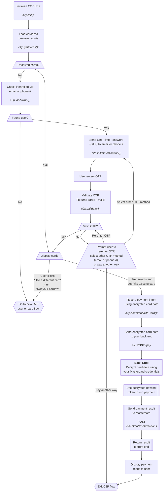

## Description:

This is a simple application demonstrating how to use the Mastercard Click to Pay SDK.

## Prerequisites:

Create a env.js file:

```shell
touch env.js
```

Add the following code to the env.js file:

```javascript
const ENV_DPA_ID = YOUR_DPA_ID;
```

Install dependencies:

```
npm install
```

## Running the application:

```
npm run start
```

## Notes:

Any changes to the code will require a hard refresh (cmd+shift+R) of the page to see the changes.

## Returning C2P User Flow:


